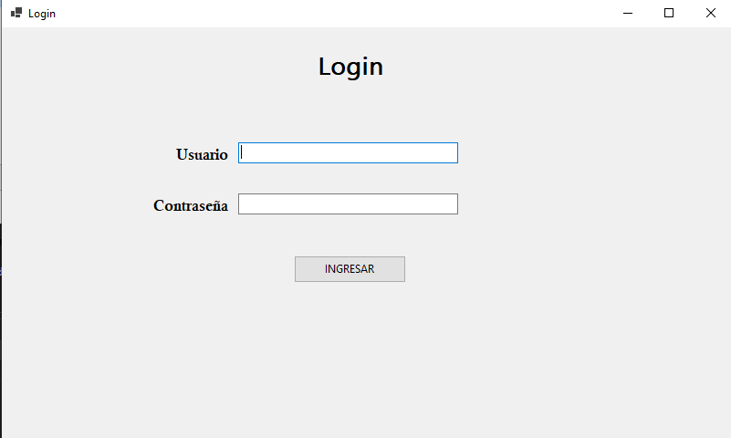
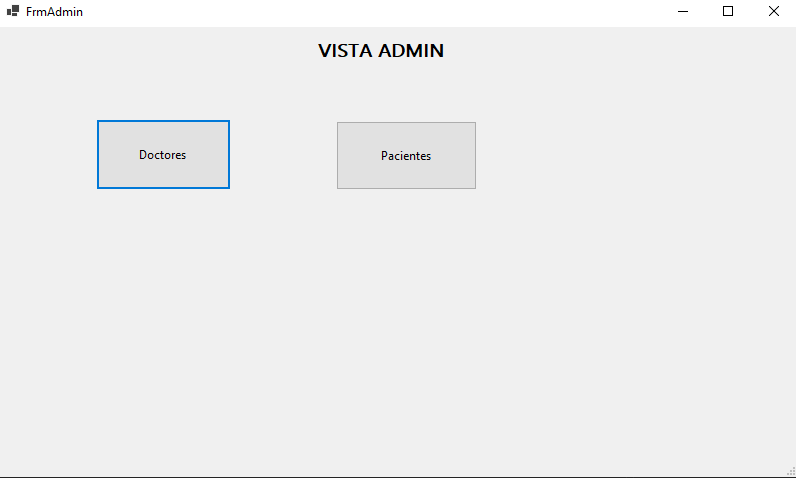
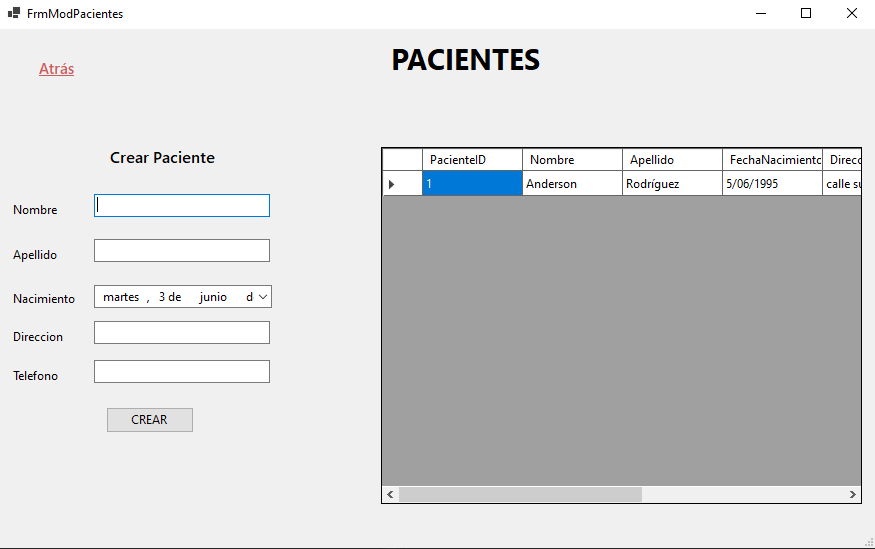
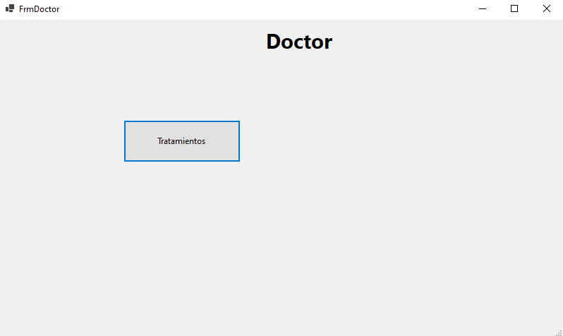
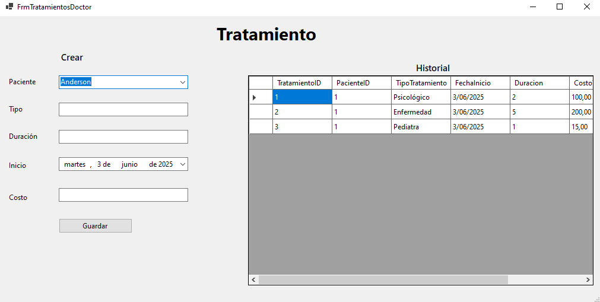
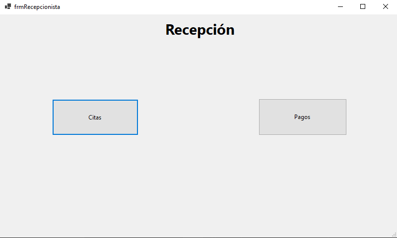
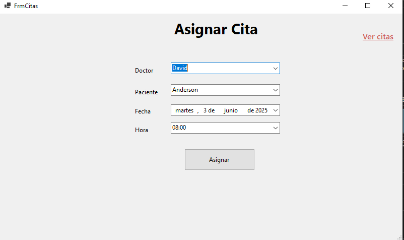
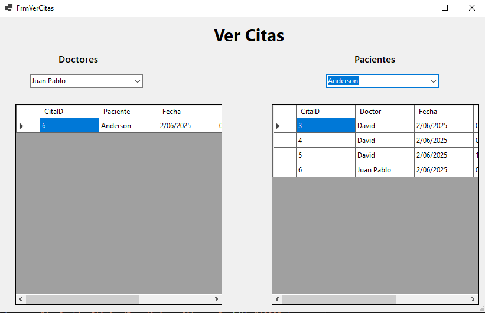
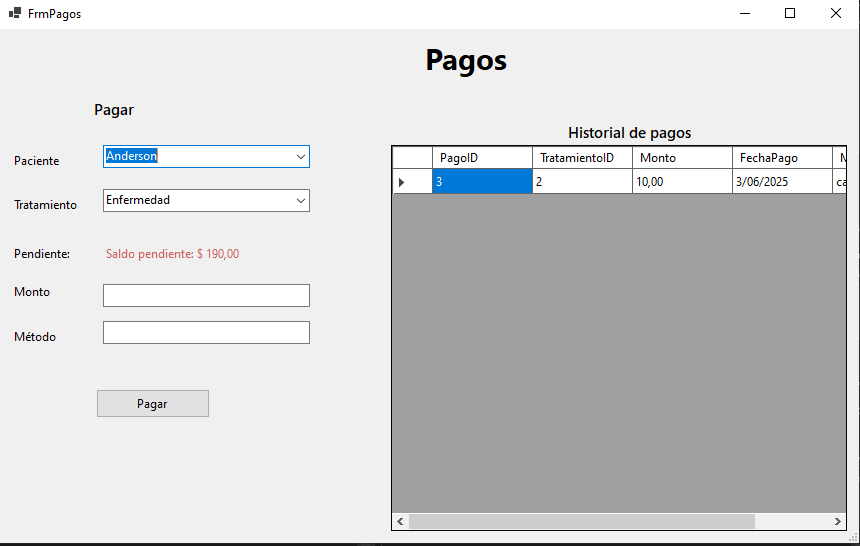

# AppGestionClinica
El propósito de este proyecto es realizar una entrega para reunir todos los conocimientos del semestre en un proyecto final, integrando con bases de datos y simulando un proyecto real. En este caso, es la gestión de una clínica, con Doctores, Pacientes, Citas, Disponibilidad, tratamientos del paciente, Pagos y gestión de roles de usuario.

---

## Funcionalidades Completas
- **Autenticación y Autorización** por roles:
  - Administrador
  - Recepcionista
  - Doctor
- **CRUD completo** para:
  - Pacientes
  - Doctores
  - Citas
  - Tratamientos
  - Pagos
  - Usuarios
- **Reglas de negocio específicas**:
  - Los doctores solo están disponibles entre 8am a 4pm, cada hora puede tener una sola cita
  - Se pueden realizar pagos parciales del tratamiento.
  - Validación de "paz y salvo" antes de asignar citas.
  - Control de roles, Administrador (Control de Usuarios, Doctores y Pacientes), Recepcionista (Asignación de Citas y pagos), Doctor (Tratamiento de paciente asignado)
- **Reportes y consultas**:
  - Visualización de citas por paciente y por doctor.
  - Reporte de todos los anteriores tratamientos del paciente asignado
  - Vista de pagos abonados al tratamiento (recepción lo ve) y deudas de los tratamientos (en una sola cita, el doctor puede asignar varios tratamientos)
- **Manejo de errores** con bloques `try-catch` y mensajes.
- **Validaciones de entrada** en formularios.
- **Persistencia con SQL Server** usando ADO.NET.
- **Aplicación de principios SOLID y patrones de diseño.**

---

## Diagrama Entidad-Relación


---

## Tecnologías utilizadas
- C# con Windows Forms (.NET Framework) -> Versión 9.0
- SQL Server
- ADO.NET con patrones de diseño
- GitHub para control de versiones

---

## 🧱 Arquitectura y Diseño

### Arquitectura de carpetas
🔹 **Data:** Donde se encuentra la conexión a la base de datos y el UnitOfWork que usa todas las interfaces (instancias) de los Repository
🔹 **Docs:** Donde se encuentra el archivo de configuración de la base de datos, y documentación e imágenes sobre el proyecto
🔹 **Entities:** Todas las entidades del sistema.
🔹 **Factory:** Factory para los menús.
🔹 **Forms:** Todas las vistas (forms) del sistema, junto con la lógica de cada uno.
🔹 **Repository/Interfaces:** Todas las interfaces para los repository del sistema.
🔹 **Repository:** Todas las instancias de las interfaces (Repository)

### 🧩 Patrones de diseño implementados

🔹 **Repository**  
Cada entidad tiene su propio repositorio para centralizar la lógica de acceso a datos.  
📌 *Ejemplo:*  
`PacienteRepository.cs` contiene todos los métodos para consultar, insertar, actualizar y eliminar pacientes desde SQL Server, separando la lógica de base de datos del resto del sistema.

🔹 **Unit of Work**  
Agrupa todos los repositorios y permite tratarlos como una unidad de trabajo, facilitando el acceso organizado desde cualquier formulario.  
📌 *Ejemplo:*  
Desde `frmRecepcionista.cs` se puede acceder a todos los repositorios a través de una sola instancia de `UnitOfWork`, como `unitOfWork.Pacientes.ObtenerTodos()`.

🔹 **Singleton**  
Controla la creación de una única instancia de la conexión a la base de datos durante toda la ejecución.  
📌 *Ejemplo:*  
`Database.GetConnection()` retorna siempre la misma instancia de `SqlConnection`, evitando conexiones múltiples no controladas.

🔹 **Factory**  
Permite crear el formulario adecuado según el rol del usuario autenticado.  
📌 *Ejemplo:*  
`MenuFactory.MenuRol(rol, doctorId)` retorna `FrmAdmin`, `FrmDoctor` o `frmRecepcionista`, simplificando la lógica de navegación.

---

### 📐 Principios SOLID aplicados

🔸 **S - Single Responsibility Principle (Principio de Responsabilidad Única)**  
Cada clase tiene una única función.  
📌 *Ejemplo:*  
`PacienteRepository.cs` solo se encarga de acceder y manipular datos de pacientes, mientras que `frmPacientes.cs` se encarga solo de la interfaz gráfica.

🔸 **O - Open/Closed Principle (Abierto/Cerrado)**  
El sistema está abierto a extensiones pero cerrado a modificaciones.  
📌 *Ejemplo:*  
Si quieres agregar un nuevo filtro de búsqueda para pacientes, puedes extender el repositorio sin modificar los métodos existentes.

🔸 **L - Liskov Substitution Principle**  
Las implementaciones de las interfaces pueden ser sustituidas por sus tipos base.  
📌 *Ejemplo:*  
Puedes sustituir cualquier repositorio (`PacienteRepository`, `DoctorRepository`) por otra clase que implemente la misma interfaz (`IPacienteRepository`, `IDoctorRepository`) sin romper la aplicación.

🔸 **I - Interface Segregation Principle**  
Se crean interfaces pequeñas y específicas por entidad, en lugar de una sola interfaz genérica.  
📌 *Ejemplo:*  
`IPacienteRepository`, `IDoctorRepository`, `IUsuarioRepository`, etc., cada una define métodos exclusivamente para su entidad.

🔸 **D - Dependency Inversion Principle**  
Los formularios dependen de interfaces, no de clases concretas.  
📌 *Ejemplo:*  
El formulario `frmPacientes` usa `IPacienteRepository`, lo que permite cambiar la implementación (por ejemplo, a una de pruebas o a una que acceda por API) sin modificar el formulario.

---

### 🧩 Ventajas de esta arquitectura

- Mayor **mantenibilidad** y posibilidad de escalar nuevas funcionalidades.
- Fácil de realizar **pruebas**.
- Separación clara entre **capas (lógica, vista, datos)**.
- Reducción de errores y fácil detección de los mismos.

---

## 🧪 Evidencias
- **Login:**


- **Vista Admin & una vista de CRUD:**



- **Vista Doctor & Tratamiento:**



- **Vista Recepción & Asignar Cita & Pagos:**





---
## 📚 Manual de Usuario Básico

1. **Login**: Ingresa con tus credenciales. El sistema mostrará el menú adecuado según tu rol.
2. **Recepcionista**:
   - Registrar pacientes y doctores.
   - Asignar citas si el paciente está a paz y salvo.
   - Registrar pagos.
3. **Doctor**:
   - Ver citas asignadas.
   - Registrar tratamientos.
4. **Administrador**:
   - Crear nuevos usuarios con rol.
   - Consultar toda la información del sistema.

## Instrucciones para compilar y ejecutar
1. Clonar el repositorio.
2. Crear la base de datos ejecutando el script `ClinicaDB.sql`.
3. Asegurarse de tener configurada la cadena de conexión en `App.config`:
   ```xml
   <connectionStrings>
     <add name="SqlConn" connectionString="Server=localhost;Database=ClinicaDB;Integrated Security=True;" providerName="System.Data.SqlClient" />
   </connectionStrings>
   ```
4. Abrir la solución `.sln` en Visual Studio.
6. Ejecutar.
7. Llenar Doctores, usuarios, pacientes, lo que haga falta para datos de prueba
