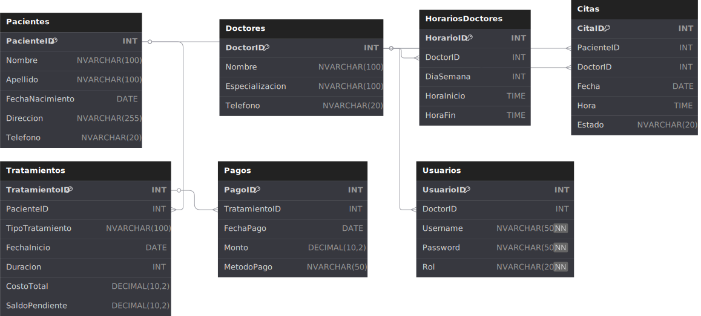

# AppGestionClinica
El propósito de este proyecto es realizar una entrega para reunir todos los conocimientos del semestre en un proyecto final, integrando con bases de datos y simulando un proyecto real. En este caso, es la gestión de una clínica, con Doctores, Pacientes, Citas, Disponibilidad, Registreo del paciente, Pagos y gestión de roles de usuario.

## Funcionalidades actuales
- Autenticación de usuarios con control de acceso por roles (Administrador y Recepcionista).
- CRUD para la entidad:
  - Doctores
- Base de datos SQL Server con relaciones y procedimientos almacenados.

## Diagrama Entidad-Relación


## Tecnologías utilizadas
- C# con Windows Forms (.NET Framework) -> Versión 9.0
- SQL Server
- ADO.NET con patrón Repository y Singleton
- Principios SOLID aplicados (SRP y DIP)
- GitHub para control de versiones

## Instrucciones para compilar y ejecutar
1. Clonar el repositorio.
2. Crear la base de datos ejecutando el script `ClinicaDB.sql`.
3. Asegurarse de tener configurada la cadena de conexión en `App.config`:
   ```xml
   <connectionStrings>
     <add name="SqlConn" connectionString="Server=localhost;Database=ClinicaDB;Integrated Security=True;" providerName="System.Data.SqlClient" />
   </connectionStrings>
   ```
4. Abrir la solución `.sln` en Visual Studio.
5. Establecer `frmLogin` como formulario de inicio.
6. Ejecutar.
